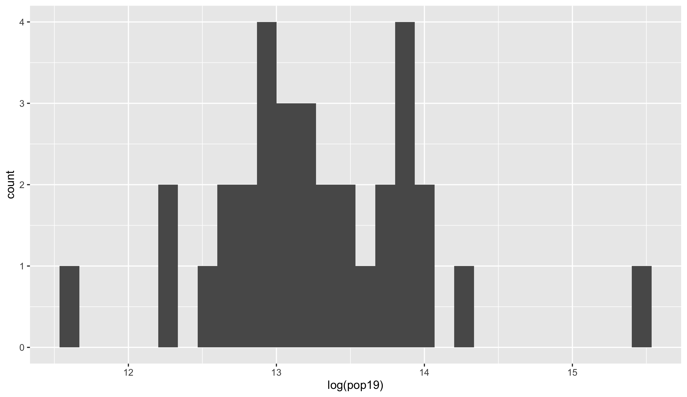
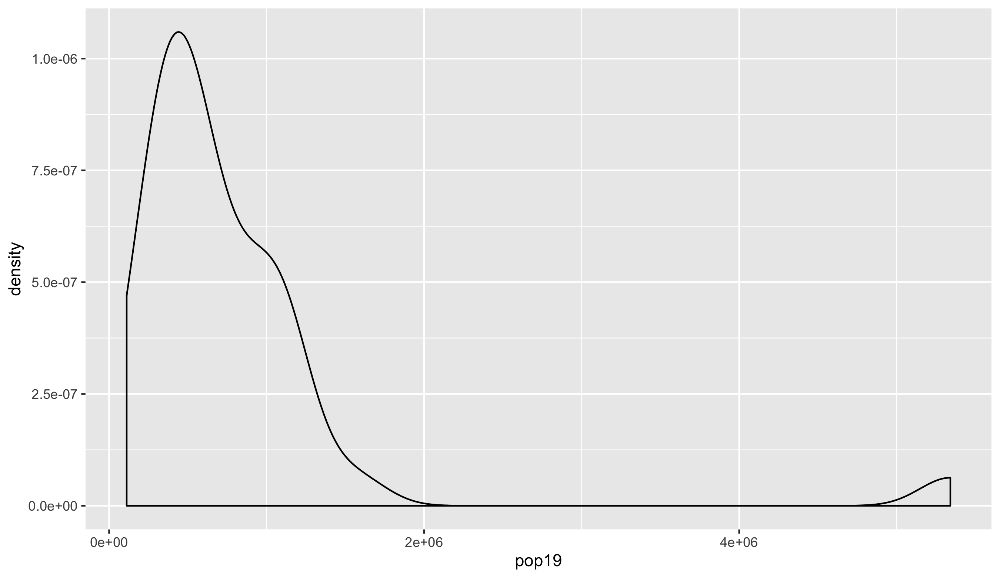
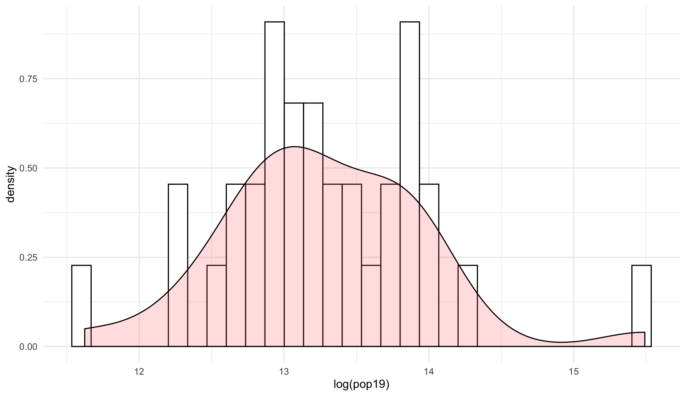
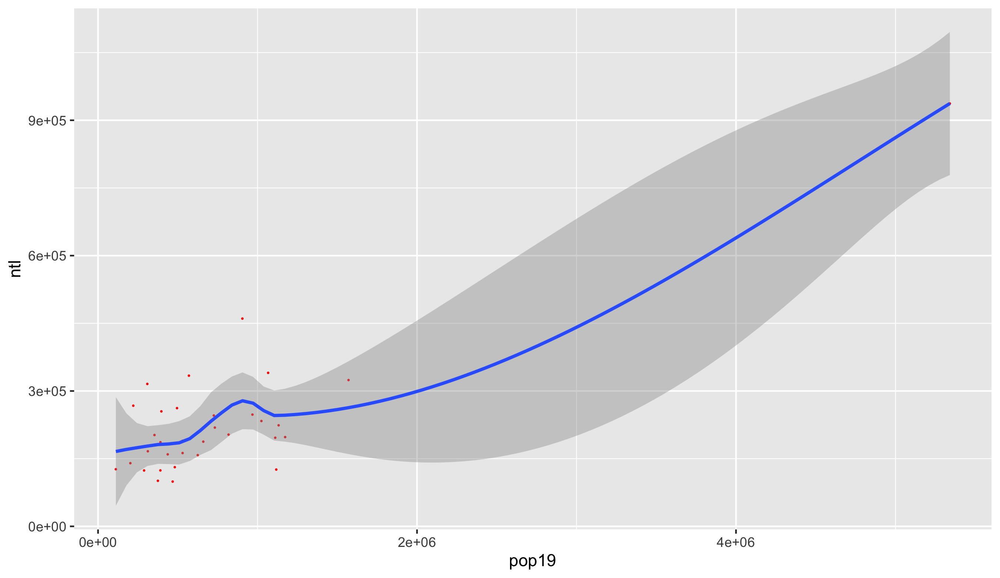
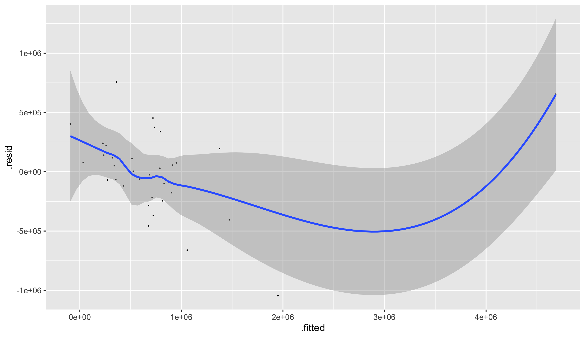
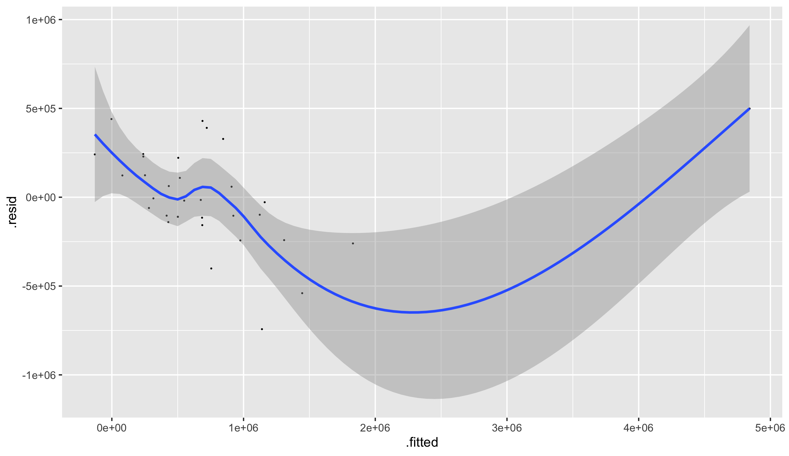

# Project 2 Deliverable: Côte d'Ivoire

## Matt Wydra 

This map is the first map for the first group check-in that I made. It has the same colors as the flag of Côte d'Ivoire.

This is the raster for Côte d'Ivoire. It took about an hour to run the block of code that put all the information in the
gridcells. Some challenges included how much time it took to compile but that was mainly it.

For Valentine's Day, I decided to show the population density as getting more and more pink as areas got more and more
dense (in regards to pupolation density).

This was what my final map was going to be for Côte d'Ivoire but I noticed I had a bug in my program (the population 
percentage was too far 'nudged' in the y-direction). This was fixed by then end but took me a while to debug. I thought
there was an error in my code and not my logic but I fixed it eventually.

This is the bar plot that shows which regions have the greatest amount of people. It takes the percentage of the total 
population that is in each region and makes a greatest to least bar plot to show the greatest percentage on the top
and the lowest on the bottom.

This is the final product for my project. On the left is my map of Côte d'Ivoire and on the right is my bar plot (described
two and one plots ago, respectively).

In this project, I encountered numerous obstacles. I struggled to use several libraries because the
R Scirpt language occasionally tells me things that are incorrect so I spend hours on a woorkaround that is unnecessary
and, ultimately, takes me further away from the solution. I ended up trying to install several packages and
ended up breaking my program (hard to explain succinctly). After another few hours trying to debug, the problem
resolved itself somehow and I still have no idea why. My next obstacle was formatting things exactly how I wanted it. 
As I tried to make minor adjustments, I accidentally deleted the information I had saved and had to re-run the raster
cluster block of code, which was then followed up about 30 minutes later by another call to that block of code for
the second administrative subdivision for the [first individual stretch goal](https://github.com/mpwydra/workshop/blob/master/Stretch_Plot.png). All in all, I enjoyed this program and 
managed to work through all the challenges I encountered.

As far as the data itself, I found that my LMIC had as many level one administrative subdivisions (adm1) as many other people's
second-level administrative subdivision (adm2) which would explain how I was able to get away with using the entire country.
Additionally, the most populated area of Côte d'Ivoire is the capital, Abidjan, which is actully a very small part of the 
country, geographically. Aside from that, I noticed that the rest of the areas were all comprable to at least one other
area. Each adm1 had similar population density to at least one other adm1.
