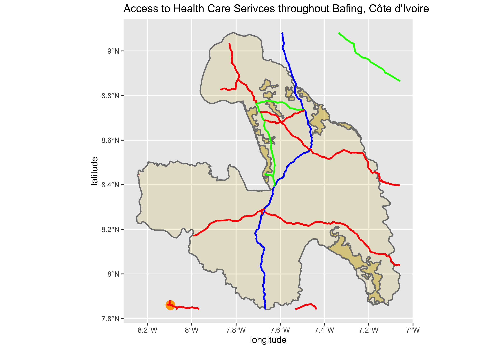

Upload the spatial plot that describes the de facto location of human settlements and urban areas, the center lines of classified roadways and the location of health care facilities by type throughout your selected and combined adm2, adm3 or adm4 areas.
Accompany your plot with a written statement that provides answers to the following information. 
Total population of selected and combined adm2, adm3 or adm4 areas and the total number of distinctly defined human settlements or urban areas
A description of the distribution of sizes and densities of all human settlements and urban areas throughout your selected and combined adm2, adm3 or adm4 areas
A description of the roadways and your estimate of the transportation networks level of service in comparison to the spatial distriubtion of human settlements and urban areas
A description of health care facilities and your estimate of service accessibility in comparison to the spatial distriubtion of human settlements and urban areas

# Project 3 Deliverable: Road Networks and HCFs of Côte d'Ivoire

## Matt Wydra 

