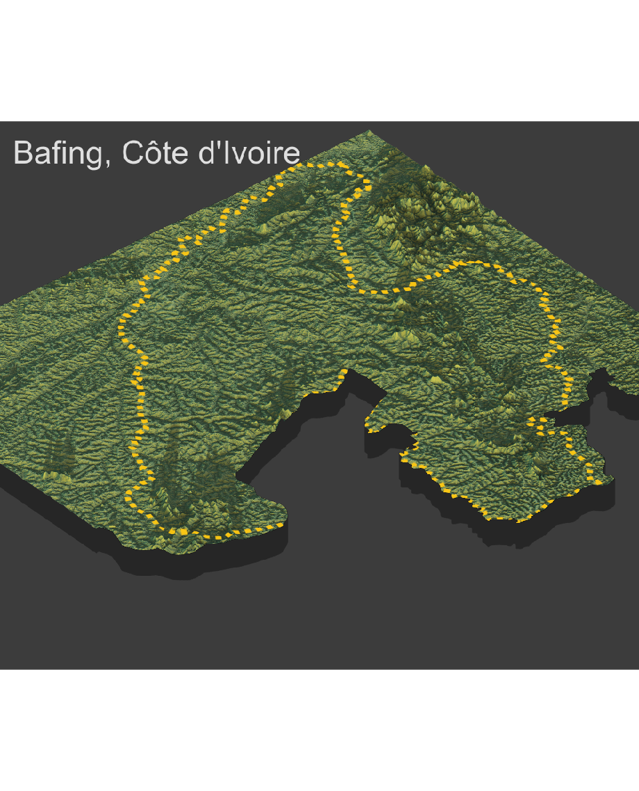
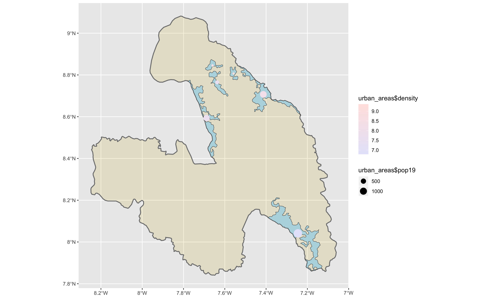

# Project 4 Deliverable: Bafing, Côte d'Ivoire

## Matt Wydra 

This is how far I managed to get in Project 4:

Though I was able to get far in project three, where I managed to complete the Urban Areas (both geographically and population density), I was unable to overlay the images onto my 3D plot. I attempted everything I could think of but I was only able to produce the above plot after getting help from Professor Frazier. Ultimately, I had too much to do with too little time to do it and it's my fault for not taking advantage of the time I had when I had it and got too far behind. Nonetheless, I can extrapolate data from the above plot and this next one: 

I noticed that the population was denser the farther away from higher elevations you went. I could tell this from looking at the political map and the urban areas map. However, I remembered seeing that my roadways and HCFs didn't line up with this. When looking at this plot:

I can tell that the settlements are very far away from the one HCF that was close enough to plot. I was curious why this was but it made sense when looking at how accessible it would be from the closeby roads (which made it fairly accessible) and when looking at the elevation differences close to the HCF and xlose to the settlements.
